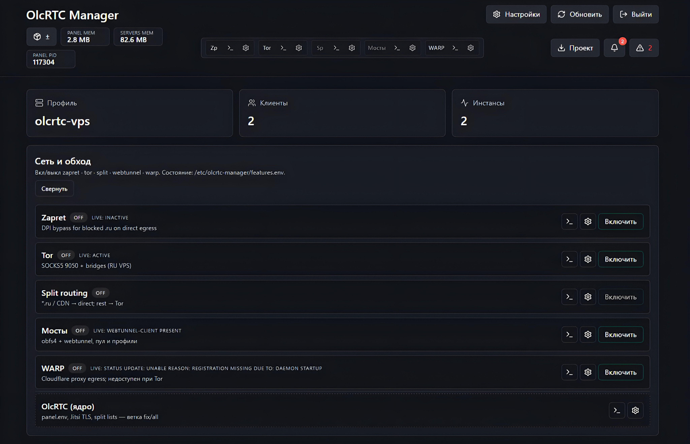

# Olc-cost-l

## В РАЗРАБОТКЕ 

Скрипты и патчи для **olcrtc-manager-panel** + **olcrtc** на RU/foreign VPS: Tor, Tor-мосты, split-маршрутизация, zapret, Warp. Olcbox.

<p align="center">
  <a href="https://htmlpreview.github.io/?https://github.com/krygag1234-a11y/Olc-cost-l/blob/main/docs/hero-image.html" target="_blank">
    <picture>
      <source type="image/webp" srcset="docs/assets/hero-panel.webp">
      
    </picture>
    <br>
  </a>
</p>

## Upstream (2026-06)

| Компонент | Ветка / источник | Ссылка |
|-----------|------------------|--------|
| olcrtc | **`master`** (pin в `data/upstream-pins.json`) | https://github.com/openlibrecommunity/olcrtc/tree/master |
| manager panel | **`main`** + патчи в `scripts/patch-olcrtc-manager-*.sh` | https://github.com/BigDaddy3334/olcrtc-manager-panel |
| local version of the panel | **`stable-v1`** | https://github.com/krygag1234-a11y/local-panel-version |
| webtunnel-client | **mirror-cry** (prebuilt) | https://github.com/krygag1234-a11y/mirror-cry/releases |
| Olcbox | **`nightly`** | https://github.com/alananisimov/olcbox/releases/tag/nightly |

Olcbox: [releases](https://github.com/alananisimov/olcbox/releases) · [CLIENT.md](docs/CLIENT.md)

---

## Быстрая установка

> **Для новичков:** Просто скопируйте команду ниже и вставьте в терминал VPS. Всё установится автоматически!

**🎯 Рекомендуемая установка** (стабильная версия панели):

```bash
curl -fsSL https://raw.githubusercontent.com/krygag1234-a11y/Olc-cost-l/main/install.sh | sudo bash -s -- --full
```

<details>
<summary>📦 Что устанавливается?</summary>

- ✅ **Панель управления** (стабильная, проверенная версия)
- ✅ **Tor** с автоматическими мостами (обход блокировок)
- ✅ **Умная маршрутизация** (Россия напрямую, остальное через Tor)
- ✅ **Zapret** для обхода DPI
- ✅ **Автообновление** мостов каждые 6 часов

**После установки откройте:** `http://ВАШ_IP:8888/admin`  
Логин и пароль будут показаны в конце установки.

</details>

<details>
<summary>🔧 Версии панели (для продвинутых)</summary>

По умолчанию устанавливается **стабильная версия панели** из нашего форка (`local-panel-version`, ветка `stable-v1`). Это проверенная версия с протестированными патчами — **рекомендуется для всех**.

**Когда использовать `--manager-latest`:**
```bash
curl -fsSL https://raw.githubusercontent.com/krygag1234-a11y/Olc-cost-l/main/install.sh | sudo bash -s -- --full --manager-latest
```

Флаг `--manager-latest` устанавливает **последнюю версию из upstream** (`olcrtc-manager-panel`, ветка `main`). Используйте только если:
- Вам нужны самые свежие функции upstream (до того как они попадут в наш форк)
- Вы готовы к возможным поломкам (upstream может измениться несовместимо с патчами)
- Вы понимаете риски экспериментальной версии

**Не используйте `--manager-latest` для production** — стабильная версия по умолчанию покрывает 99% случаев.

</details>

> 🎨 **Новое!** Установщик теперь с интерактивным TUI: анимированные спиннеры, прогресс-бары, цветные логи и интерактивные меню.

**🔒 Установка на localhost** (доступ только через SSH-туннель):
> **Примечание:** Флаг `--ssh` можно добавить к любой команде. Панель будет доступна только через SSH-туннель, а не через открытый IP.

---

## Примеры выборочных команд со флагами

### "ВСЕ, НО БЕЗ .."

```bash
# Иностранный VPS (без Tor и мостов):
curl -fsSL https://raw.githubusercontent.com/krygag1234-a11y/Olc-cost-l/main/install.sh \
  | sudo bash -s -- --full --no-tor

# RU VPS (без разделения маршрутов, весь трафик через Tor):
curl -fsSL https://raw.githubusercontent.com/krygag1234-a11y/Olc-cost-l/main/install.sh \
  | sudo bash -s -- --full --no-split

# RU VPS (без Zapret DPI обхода):
curl -fsSL https://raw.githubusercontent.com/krygag1234-a11y/Olc-cost-l/main/install.sh \
  | sudo bash -s -- --full --no-zapret

# RU VPS (без мостов, только прямой Tor):
curl -fsSL https://raw.githubusercontent.com/krygag1234-a11y/Olc-cost-l/main/install.sh \
  | sudo bash -s -- --full --no-bridges
```

### "ТОЛЬКО С .."

```bash
# Иностранный VPS + Cloudflare WARP (proxy, без Tor):
curl -fsSL https://raw.githubusercontent.com/krygag1234-a11y/Olc-cost-l/main/install.sh \
  | sudo bash -s -- --warp

# Установить только Tor + Панель:
curl -fsSL https://raw.githubusercontent.com/krygag1234-a11y/Olc-cost-l/main/install.sh \
  | sudo bash -s -- --tor

# Установить только Zapret + Панель:
curl -fsSL https://raw.githubusercontent.com/krygag1234-a11y/Olc-cost-l/main/install.sh \
  | sudo bash -s -- --zapret

# Установить только мосты для Tor + Панель:
curl -fsSL https://raw.githubusercontent.com/krygag1234-a11y/Olc-cost-l/main/install.sh \
  | sudo bash -s -- --bridges

# Установить только split-маршрутизацию + Панель (требует Tor):
curl -fsSL https://raw.githubusercontent.com/krygag1234-a11y/Olc-cost-l/main/install.sh \
  | sudo bash -s -- --split
```

### Таблица режимов установки

| Команда | Tor | Bridges | Split | Zapret | Панель | Назначение |
|---------|-----|---------|-------|--------|--------|------------|
| `--full` | ✅ | ✅ | ✅ | ✅ | ✅ | **RU VPS:** полный стек обхода блокировок |
| `--full --no-tor` | ❌ | ❌ | ❌ | ✅ | ✅ | **Foreign VPS:** только zapret + панель |
| `--full --no-bridges` | ✅ | ❌ | ✅ | ✅ | ✅ | RU VPS без мостов (прямой Tor) |
| `--full --no-split` | ✅ | ✅ | ❌ | ✅ | ✅ | Весь трафик через Tor |
| `--full --no-zapret` | ✅ | ✅ | ✅ | ❌ | ✅ | RU VPS без DPI-обхода |
| `--tor` | ✅ | ❌ | ❌ | ❌ | ✅ | Только Tor (без мостов/split/zapret) |
| `--tor --bridges` | ✅ | ✅ | ❌ | ❌ | ✅ | Tor + мосты (без split/zapret) |
| `--tor --split` | ✅ | ❌ | ✅ | ❌ | ✅ | Tor + умная маршрутизация |
| `--bridges` | ❌ | ✅ | ❌ | ❌ | ✅ | Только мосты (требует уже установленный Tor) |
| `--split` | ❌ | ❌ | ✅ | ❌ | ✅ | Только split (требует уже установленный Tor) |
| `--zapret` | ❌ | ❌ | ❌ | ✅ | ✅ | Только zapret DPI-обход |
| `--warp` | ❌ | ❌ | ❌ | ❌ | ✅ | Cloudflare WARP proxy |
| `--tor --bridges --split --zapret` | ✅ | ✅ | ✅ | ✅ | ✅ | Эквивалент `--full` (покомпонентная сборка) |

> 💡 Флаги можно комбинировать!

**Примеры комбинаций:**
```bash
# RU VPS: Tor + мосты + zapret (без split):
curl -fsSL https://raw.githubusercontent.com/krygag1234-a11y/Olc-cost-l/main/install.sh \
  | sudo bash -s -- --tor --bridges --zapret

# Foreign VPS: только панель + zapret (без Tor):
curl -fsSL https://raw.githubusercontent.com/krygag1234-a11y/Olc-cost-l/main/install.sh \
  | sudo bash -s -- --zapret

# Минимальная установка: только панель (без компонентов):
curl -fsSL https://raw.githubusercontent.com/krygag1234-a11y/Olc-cost-l/main/install.sh \
  | sudo bash -s --
```

---

## 🔄 Обновление

> **Для новичков:** Эта команда обновит всё автоматически, сохранив ваши настройки.

**Рекомендуемое обновление** (стабильная версия):

```bash
sudo olc-update
```

или полная команда:

```bash
curl -fsSL https://raw.githubusercontent.com/krygag1234-a11y/Olc-cost-l/main/install.sh | sudo bash -s -- --update
```

<details>
<summary>⚙️ Другие варианты обновления (для продвинутых)</summary>

**Обновление до последней версии панели:**
```bash
sudo olc-update --manager-latest
```

**Обновление без смены версии панели:**
```bash
sudo olc-update
```

**Доустановка недостающих компонентов** (без полной пересборки):
```bash
sudo olc-update --incremental
```

**Сравнение режимов обновления:**

| Режим | Что делает | Когда использовать |
|-------|------------|-------------------|
| `--update` | Git pull + пересборка olcrtc/manager + обновление списков доменов/CIDR | Обновление кода после upstream изменений |
| `--incremental` | Проверяет установленные компоненты, доустанавливает недостающие | Добавление компонентов (был `--tor`, хочу `+zapret`) |

**Пример:**
```bash
# Была установка: --tor
# Теперь хочу добавить zapret + bridges:
sudo olc-update --incremental --zapret --bridges
```

> `--incremental` **не пересобирает** уже установленное, только добавляет новое. Быстрее, чем `--update`.

**Принудительная переустановка:**
```bash
curl -fsSL https://raw.githubusercontent.com/krygag1234-a11y/Olc-cost-l/main/install.sh | sudo bash -s -- --full
```

</details>

## Режимы bootstrap (установки)

<details>
<summary>📋 Полный список флагов (для продвинутых пользователей)</summary>

Флаги можно комбинировать! Например, `--bridges --zapret` установит панель только с мостами и запретом.

| Флаг | Результат |
|------|-----------|
| **ВЕРСИЯ ПАНЕЛИ** | |
| По умолчанию | Стабильная версия из нашего форка (рекомендуется) |
| `--manager-latest` | Последняя версия upstream (экспериментальная, может сломаться) |
| **ВСЕ, НО БЕЗ ..** | |
| `--full` | **Полная установка:** Панель + Tor + мосты + split + zapret |
| `--full --no-tor` | Устанавливает всё, кроме Tor и мостов |
| `--full --no-split` | Без разделения: весь трафик идёт через Tor |
| `--full --no-zapret` | Без DPI-обхода (zapret не устанавливается) |
| `--full --no-bridges`| Без мостов для Tor (только прямой Tor) |
| **ТОЛЬКО С ..** | |
| `--warp` | Устанавливается только WARP + панель (без Tor) |
| `--tor` | Устанавливается только Tor + панель |
| `--split` | Устанавливается только Split + панель (требует Tor) |
| `--zapret` | Устанавливается только Zapret + панель |
| `--bridges`| Устанавливается только мосты для Tor + панель |
| **РЕЖИМЫ УСТАНОВКИ** | |
| `--update` | Обновление: git pull, пересборка, обновление списков |
| `--incremental` | Доустановка: добавить недостающие компоненты без полной пересборки |
| `--resume` | Продолжить прерванную установку с последнего успешного шага |
| `--fresh-state` | Очистить состояние установки и начать заново |
| `--rebuild-only` | Только пересборка бинарников (без переустановки компонентов) |
| **ДОСТУП К ПАНЕЛИ** | |
| `--ssh` | Панель доступна только через SSH-туннель (безопаснее) |
| `--ip` | Вернуть открытый режим панели на IP (по умолчанию) |
| **ДРУГОЕ** | |
| `--force-sha-update` | Принудительно обновить pinned SHA из upstream |
| `--profile` | Использовать сохранённый профиль установки |
| `--show-profile` | Показать текущий профиль установки |
| `--state` | Показать состояние установки |
| `--interactive` | Показать интерактивное меню выбора компонентов |

</details>

Панель: `http://ВАШ_IP_ИЛИ_DDNS:8888/admin` либо `http://127.0.0.1:8888/admin` · [QUICKSTART-RU.md](docs/QUICKSTART-RU.md) · [UPDATE.md](docs/UPDATE.md)

## Доступ к панели через localhost / SSH-туннель

Если не хотите открывать порт панели наружу, добавьте `--ssh` к любой команде установки или обновления:

```bash
# Установка с SSH-туннелем (рекомендуется добавлять):
curl -fsSL https://raw.githubusercontent.com/krygag1234-a11y/Olc-cost-l/main/install.sh \
  | sudo bash -s -- --full --ssh

# Обновление с SSH-туннелем:
curl -fsSL https://raw.githubusercontent.com/krygag1234-a11y/Olc-cost-l/main/install.sh \
  | sudo bash -s -- --update --ssh

# Или через olc-update:
sudo olc-update --ssh
```

Этот выбор сохраняется в `/etc/olcrtc-manager/deploy-profile.json`: следующие `--update` и обычные доустановки будут помнить, что панель должна слушать только `127.0.0.1`. Чтобы вернуть обычный открытый режим:

```bash
sudo olc-update --ip
```

Для доступа к панели откройте SSH-туннель со своего компьютера/ноутбука, а не внутри VPS. Команду ниже нужно выполнить в терминале на вашем устройстве:

```bash
ssh -L 8888:127.0.0.1:8888 root@ВАШ_IP_ИЛИ_DDNS
```

Пока это SSH-подключение открыто, в браузере на этом же устройстве откройте:

```text
http://127.0.0.1:8888/admin
```

Установщик в конце выводит готовую ссылку на панель и пример команды для SSH-туннеля с IP текущего VPS. Если IP динамический, используйте актуальный IP или DDNS только в SSH-команде; сама панель в режиме `--ssh` не зависит от внешнего IP и остаётся привязанной к `127.0.0.1`. Интерфейс панели и сообщения установщика по умолчанию русские (`OLC_LANG=ru`, `OLC_PANEL_LANG=ru`).

## Полное удаление

```bash
curl -fsSL https://raw.githubusercontent.com/krygag1234-a11y/Olc-cost-l/main/uninstall.sh | sudo bash
curl -fsSL .../uninstall.sh | sudo bash -s -- --purge-repo   # + удалить /opt/Olc-cost-l
curl -fsSL .../uninstall.sh | sudo bash -s -- --keep-tor     # оставить tor@default
```

> **Или короткая команда** (если репозиторий уже установлен):
> ```bash
> sudo olc-purge
> ```

## Очистка кэшей

После `--full`, `--update` и пересборки панель/Go могут временно занимать много места в `/tmp`, Go build cache и npm cache. Эти файлы не нужны для работы установленной панели; они только ускоряют повторную сборку.

```bash
# Очистить только сборочные кэши, без удаления панели и сервисов:
sudo olc-cleanup-caches
```

Скрипты установки и обновления теперь чистят временные сборочные кэши автоматически. `sudo olc-purge` и `uninstall.sh` тоже удаляют эти кэши при полном удалении. По умолчанию Go module cache (`/root/go/pkg/mod`) сохраняется; если нужно очистить и его, запустите с `OLC_CLEAN_GO_MOD_CACHE=1`.

---


## Документация

| Документ | Тема |
|----------|------|
| [VPS-SETUP.md](docs/VPS-SETUP.md) | Полная установка, таймеры, troubleshooting |
| [TOR-BRIDGES.md](docs/TOR-BRIDGES.md) | Пул, ротация, deep check, snowflake |
| [PERFORMANCE.md](docs/PERFORMANCE.md) | Потолок Tor, параллельные потоки vs WebRTC |
| [SPLIT-ROUTING.md](docs/SPLIT-ROUTING.md) | Direct vs Tor по доменам |
| [RU-BLOCKED-TOR.md](docs/RU-BLOCKED-TOR.md) | Заблокированные `.ru` + zapret |
| [ZAPRET-OPTIONAL.md](docs/ZAPRET-OPTIONAL.md) | Zapret на VPS |
| [SECURITY-NETWORK.md](docs/SECURITY-NETWORK.md) | SOCKS, авторизация |
| [SAFETY.md](docs/SAFETY.md) | [DEV] Allowlist путей, откат |
| [CLIENT.md](docs/CLIENT.md) | Olcbox |
| [patches/PATCHES.md](patches/PATCHES.md) | Патчи olcrtc / manager |
| [INTEGRATION-GAP.md](docs/INTEGRATION-GAP.md) | [DEV] Отличия Olc-cost-l от upstream |
| [UPSTREAM-SYNC.md](docs/UPSTREAM-SYNC.md) | [DEV] Обновление upstream + zapret4rocket |
| [FEATURES.md](docs/FEATURES.md) | `olc-feature` — toggle zapret/tor/split/webtunnel/warp |
| [WARP-OPTIONAL.md](docs/WARP-OPTIONAL.md) | Cloudflare WARP (proxy mode, foreign VPS) |
| [RESUME-INSTALL.md](docs/RESUME-INSTALL.md) | [DEV] Resumable install/update + webtunnel mirror |
| [AGENT-REPO.md](docs/AGENT-REPO.md) | Карта кода репозитория (для ИИ-агентов) |
| [AGENT-VPS.md](docs/AGENT-VPS.md) | Карта runtime VPS окружения (для ИИ-агентов) |
| [API-ENDPOINTS.md](docs/API-ENDPOINTS.md) | API эндпоинты панели (golden panel) |

---

## Tor — основные команды

```bash
# Обновить пул (все источники)
sudo /opt/Olc-cost-l/scripts/fetch-bridge-extra-sources.sh

# Применить лучшие мосты + restart Tor
sudo BRIDGE_TYPES=webtunnel,obfs4 /opt/Olc-cost-l/scripts/tor-bridge-pool.sh --apply

# Deep bootstrap (реальный tor на каждый мост)
sudo /opt/Olc-cost-l/scripts/tor-bridge-deep-check.sh --from-pool --limit 10 --jobs 2

# Быстрая ротация без скачивания
sudo /opt/Olc-cost-l/scripts/tor-bridge-rotate.sh
```

Таймеры: `olcrtc-tor-bridge-pool.timer`, `olcrtc-tor-bridge-monitor.timer`, `olcrtc-tor-bridge-deep.timer`

## Отличия от upstream panel

- API логов, HOST_NETWORK, EXIT_PROXY при живом Tor
- Split: `*.ru` + CDN direct; blocked `.ru` + zapret; YouTube → Tor
- Bridge pool: multi-source, webtunnel-first, health + deep bootstrap
- Healthcheck по `/admin` (не `/`)

---

## Upstream sync

```bash
sudo /opt/Olc-cost-l/scripts/upstream-sync.sh --check
sudo /opt/Olc-cost-l/scripts/upstream-sync.sh --apply
sudo /opt/Olc-cost-l/scripts/sync-zapret4rocket.sh --check
```

См. [UPSTREAM-SYNC.md](docs/UPSTREAM-SYNC.md)

---

`OLCRTC_PUBLIC_URL=http://ваш-домен:8888` в `/etc/olcrtc-manager/panel.env`

---

## 🎨 Новое: Интерактивный TUI

Установщик теперь с современным Terminal UI:

- ⚡ Анимированные спиннеры при установке
- 📊 Progress bar для патчинга и сборки
- 🎯 Интерактивное меню выбора режима
- 🎨 Цветные логи (info, success, warning, error)

Подробнее: [docs/TUI.md](docs/TUI.md)

**Demo:**
```bash
bash scripts/demo-tui.sh
```
