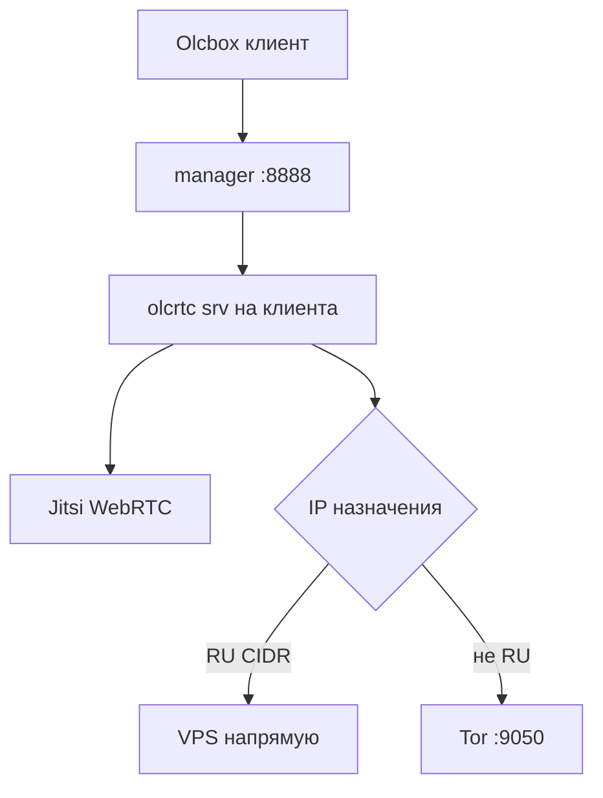

# OlcRTC VPS — полная документация

**Обновлено:** 2026-05-22  
**Ветка olcrtc:** [`master`](https://github.com/openlibrecommunity/olcrtc/tree/master) (`refactor/universal-carrier` смержена, отдельной ветки нет)  
**Панель:** [olcrtc-manager-panel](https://github.com/BigDaddy3334/olcrtc-manager-panel) + **патчи** в `/opt/Olc-cost-l/patches/`  
**Клиент:** [Olcbox nightly](https://github.com/alananisimov/olcbox/releases/tag/nightly) · [все релизы](https://github.com/alananisimov/olcbox/releases) · [репо](https://github.com/alananisimov/olcbox) — см. [CLIENT.md](CLIENT.md)

Копия: `/root/VPS-SETUP.md` → симлинк сюда.

---

## Быстрый старт

```bash
# Чистый VPS (RU, с Tor + split + патчи)
chmod +x /opt/Olc-cost-l/scripts/*.sh
bash /opt/Olc-cost-l/scripts/agent-bootstrap.sh --full

# Иностранный VPS — без Tor
bash /opt/Olc-cost-l/scripts/agent-bootstrap.sh --full --no-tor

# Только пересобрать патченные бинарники
bash /opt/Olc-cost-l/scripts/agent-bootstrap.sh --rebuild-only
```

---

## Что ставится и чем отличается от upstream

| Компонент | Upstream | На этом VPS |
|-----------|----------|-------------|
| olcrtc | `master` | + payload Jitsi 16K, split RU/Tor (`internal/routing/cidr.go`), `session.DirectCIDRsFile` |
| manager | `main` без патчей | + логи API query, HOST_NETWORK, EXIT_PROXY если Tor жив, PUBLIC_URL, Jitsi liveness, Telemost URL |
| Tor bridges | вручную | пул из [TOR_BRIDGES_ALL.txt](https://raw.githubusercontent.com/igareck/vpn-configs-for-russia/refs/heads/main/TOR-BRIDGES/TOR_BRIDGES_ALL.txt), мониторинг, ротация |
| Капча bridges.torproject.org | — | **не автоматизируем** ([gist s3rgeym](https://gist.github.com/s3rgeym/48405a282d61fd6bf74aed578f483111) — капча, с RU IP неудобно) |

Список патчей: `/opt/Olc-cost-l/patches/PATCHES.md`  
Применение: `/opt/Olc-cost-l/scripts/apply-olcrtc-patches.sh`

---

## Динамический IP VPS (DDNS)

В Olcbox импортируйте подписку по **домену**, не по IP:  
`http://ВАШ-DDNS:8888/<client_id>/`

В `/etc/olcrtc-manager/panel.env`:
```bash
OLCRTC_PUBLIC_URL=http://ВАШ-DDNS:8888
```

---

## Архитектура



- **Tor и split** — на **все** серверные инстансы (все клиенты в панели), из `Environment` systemd.
- **Jitsi-медиа** — не через Tor.
- **Новый клиент в панели** — автоматически получает те же правила.

---

## Tor: пул мостов

### Источник

Прямая загрузка (без мусора в torrc):

`https://raw.githubusercontent.com/igareck/vpn-configs-for-russia/refs/heads/main/TOR-BRIDGES/TOR_BRIDGES_ALL.txt`

Скрипт **отбрасывает**:
- строки с `#` (profile-title, Date/Time, секции вроде `# VANILLA TOR BRIDGES:`)
- `vless://`, `trojan://`, `ss://`
- оставляет только `webtunnel`, `obfs4`, vanilla `IP:PORT FINGERPRINT`

### Мониторинг и «не удалять сразу»

| Файл | Назначение |
|------|------------|
| `/var/lib/olcrtc/tor-bridges-pool.txt` | Весь пул кандидатов |
| `/var/lib/olcrtc/tor-bridge-health.tsv` | ok/fail/streak, last_ok |
| `/etc/tor/bridges.conf` | Активные мосты (≈12 по умолчанию) |

- Проба каждые **20 мин** (`olcrtc-tor-bridge-monitor.timer`) — только health, без рестарта Tor.
- Полное обновление из репо каждые **6 ч** (`olcrtc-tor-bridge-pool.timer`).
- Мост **удаляется из активных**, только если `fail_streak ≥ 8` и последний успех был **> 6 ч** назад.
- Если активных < **target (12)** — добор из пула/репо.

### Команды

```bash
# Скачать ALL.txt, распарсить, пополнить пул
/opt/Olc-cost-l/scripts/tor-bridge-pool.sh --fetch

# Проба + выбор лучших + рестарт Tor
/opt/Olc-cost-l/scripts/tor-bridge-pool.sh --url-only --target 12 --types webtunnel

# Только health (cron)
/opt/Olc-cost-l/scripts/tor-bridge-monitor.sh

# Срочная ротация окна мостов
/opt/Olc-cost-l/scripts/tor-bridge-rotate.sh

# Типы: webtunnel | obfs4 | vanilla | webtunnel,obfs4
BRIDGE_TYPES=webtunnel,obfs4 tor-bridge-pool.sh --fetch
```

**Чёрный список:** `EDF46C5F...` (Tor 0.4.8.10 core-dump).

### bridges.torproject.org (gist)

Ручная капча — **не в скриптах**. При желании добавьте строки `Bridge obfs4 ...` в `/var/lib/olcrtc/tor-user-bridges.txt` и включите вручную в `bridges.conf`.

---

## Split: RU напрямую, остальное Tor

```bash
/opt/Olc-cost-l/scripts/fetch-ru-cidrs.sh   # /var/lib/olcrtc/ru-cidrs.txt
```

В YAML клиента (автоматически): `socks.direct_cidrs_file: /var/lib/olcrtc/ru-cidrs.txt`

Отключить split: `agent-bootstrap.sh --no-split` или убрать файл + `OLCRTC_DIRECT_CIDRS=`.

---

## Скрипты (`/opt/Olc-cost-l/scripts/`)

| Скрипт | Назначение |
|--------|------------|
| **agent-bootstrap.sh** | Главный деплой: `--full`, `--no-tor`, `--no-split`, `--rebuild-only` |
| **apply-olcrtc-patches.sh** | Клон + патчи + сборка в `/usr/local/bin/` |
| **tor-bridge-pool.sh** | Пул, health, `bridges.conf` |
| **tor-bridge-monitor.sh** | Проба без рестарта Tor |
| **tor-bridge-rotate.sh** | Сдвиг окна мостов |
| **update-tor-bridges.sh** | Алиас `--fetch` + pool |
| **fetch-ru-cidrs.sh** | RU IPv4 для direct |
| **network-recovery.sh** | После обрыва сети |
| **healthcheck.sh** | Cron */10 |

---

## Установка с нуля (ручная)

### 1. Пакеты

```bash
apt update && apt install -y git curl build-essential golang-go jq patch \
  tor obfs4proxy apparmor-utils
```

### 2. Патченная сборка (обязательно)

```bash
bash /opt/Olc-cost-l/scripts/apply-olcrtc-patches.sh
```

Не используйте «голый» upstream manager — **не будет** логов в панели, Jitsi liveness, split, умного EXIT_PROXY.

### 3. webtunnel-client

```bash
git clone --depth 1 https://gitlab.torproject.org/tpo/anti-censorship/pluggable-transports/webtunnel.git /tmp/webtunnel
(cd /tmp/webtunnel/client && go build -o /usr/bin/webtunnel-client .)
echo '/usr/bin/webtunnel-client Pix,' >> /etc/apparmor.d/local/system_tor
apparmor_parser -r /etc/apparmor.d/usr.bin.tor
```

### 4. Tor pool + timers

```bash
systemctl enable --now olcrtc-tor-bridge-pool.timer olcrtc-tor-bridge-monitor.timer
/opt/Olc-cost-l/scripts/tor-bridge-pool.sh --fetch --url-only --types webtunnel --target 12
```

### 5. manager

```bash
# см. agent-bootstrap.sh → olcrtc-manager.service
systemctl enable --now olcrtc-manager
```

### 6. Клиент в панели

- Carrier: **jitsi**
- Transport: **datachannel**
- Room URL полностью: `https://meet.example.org/RoomName`
- Подписка в [Olcbox](https://github.com/alananisimov/olcbox) по DDNS

---

## Режимы деплоя (гибкость)

| Сценарий | Команда |
|----------|---------|
| RU VPS, Tor + split + Jitsi | `agent-bootstrap.sh --full` |
| Иностранный VPS, без Tor | `agent-bootstrap.sh --full --no-tor` |
| Tor без split (всё через exit) | `agent-bootstrap.sh --full --no-split` |
| Уже стоит olcrtc, только патчи | `agent-bootstrap.sh --rebuild-only` |
| Только конфиг Tor/таймеры | `agent-bootstrap.sh` (без `--full`) |

---

## Проверка

```bash
systemctl is-active tor@default olcrtc-manager
curl -s --socks5-hostname 127.0.0.1:9050 https://check.torproject.org/api/ip | jq .
grep direct_cidrs /tmp/olcrtc-manager-srv*.yaml
wc -l /var/lib/olcrtc/tor-bridges-pool.txt /var/lib/olcrtc/ru-cidrs.txt
journalctl -u olcrtc-manager -n 20 --no-pager
```

Логи olcrtc в панели: **Clients → Logs** (API: `/api/logs?client_id=&room_id=&transport=`).

---

## Troubleshooting

| Симптом | Действие |
|---------|----------|
| Jitsi падает, SOCKS refused | Tor мёртв; `tor-bridge-rotate.sh`; manager работает без SOCKS пока Tor down |
| Tor core-dump | убрать мост `EDF46C5F`; `tor-bridge-pool.sh --fetch` |
| Olcbox offline | DDNS вместо IP |
| Логи 404 в панели | нужен **патченный** manager |
| YouTube блок | проверить Tor exit через SOCKS |
| RU сайты медленно | проверить `direct_cidrs_file` в yaml |

---

## Runbook для AI-агента

1. `id -u` → 0  
2. Прочитать `/opt/Olc-cost-l/VPS-SETUP.md` и `/opt/Olc-cost-l/patches/PATCHES.md`  
3. `agent-bootstrap.sh --full` или `--full --no-tor` по региону VPS  
4. `systemctl is-active tor@default olcrtc-manager` (Tor опционально)  
5. `apply-olcrtc-patches.sh` если бинарники не патченные  
6. `tor-bridge-pool.sh --fetch --url-only` на RU  
7. DDNS + `OLCRTC_PUBLIC_URL`  
8. TCP 8888 открыт  

**Ветка:** `master` (clone: `OLCRTC_BRANCH=master`).  
**Панель:** `main` на [olcrtc-manager-panel](https://github.com/BigDaddy3334/olcrtc-manager-panel) + патчи из `patches/olcrtc-manager-main.go.patch`.

---

## Переменные окружения

| Переменная | Описание |
|------------|----------|
| `OLCRTC_EXIT_PROXY` | `127.0.0.1:9050` |
| `OLCRTC_DIRECT_CIDRS` | путь к RU CIDR |
| `OLCRTC_PUBLIC_URL` | DDNS для подписок |
| `OLCRTC_HOST_NETWORK` | `1` |
| `OLCRTC_ENABLE_TOR` | для bootstrap: `0`/`1` |
| `BRIDGE_TYPES` | `webtunnel`, `obfs4`, … |
| `TARGET_ACTIVE` | целевое число мостов в torrc (12) |

---

## Ссылки

- [olcrtc master](https://github.com/openlibrecommunity/olcrtc/tree/master)
- [olcrtc-manager-panel](https://github.com/BigDaddy3334/olcrtc-manager-panel)
- [olcbox](https://github.com/alananisimov/olcbox)
- [igareck TOR-BRIDGES](https://github.com/igareck/vpn-configs-for-russia/tree/main/TOR-BRIDGES)
- [webtunnel PT](https://gitlab.torproject.org/tpo/anti-censorship/pluggable-transports/webtunnel)
