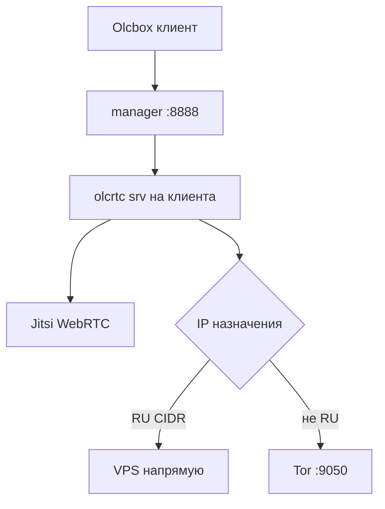

# OlcRTC VPS — полная документация

**Обновлено:** 2026-05-27  
**Ветка olcrtc:** [`fix/all`](https://github.com/openlibrecommunity/olcrtc/tree/fix/all) — pin в `data/upstream-pins.json`  
**Панель:** [olcrtc-manager-panel](https://github.com/BigDaddy3334/olcrtc-manager-panel) + **патчи** `scripts/patch-olcrtc-manager-*.sh` → `apply-olcrtc-patches.sh`  
**webtunnel:** бинарник [mirror-cry](https://github.com/krygag1234-a11y/mirror-cry/releases/latest), не gitlab.torproject.org  
**Клиент:** [Olcbox nightly](https://github.com/alananisimov/olcbox/releases/tag/nightly) — [CLIENT.md](CLIENT.md)

Общедоступный демо-VPS (без секретов на хосте): [PUBLIC-DEMO-VPS.md](PUBLIC-DEMO-VPS.md).

---

## Быстрый старт

```bash
# Установка или обновление (одна команда, RU VPS)
curl -fsSL https://raw.githubusercontent.com/krygag1234-a11y/Olc-cost-l/main/install.sh | sudo bash

# Иностранный VPS — без Tor, split, мостов
curl -fsSL .../install.sh | sudo bash -s -- --no-tor

# Полное удаление нашего стека
curl -fsSL https://raw.githubusercontent.com/krygag1234-a11y/Olc-cost-l/main/uninstall.sh | sudo bash -s -- --purge-repo

# Из уже клонированного репо
chmod +x /opt/Olc-cost-l/scripts/*.sh
bash /opt/Olc-cost-l/scripts/agent-bootstrap.sh --full      # чистый деплой
bash /opt/Olc-cost-l/scripts/agent-bootstrap.sh --update    # только refresh
bash /opt/Olc-cost-l/scripts/agent-bootstrap.sh --rebuild-only
```

---

## Что ставится и чем отличается от upstream

| Компонент | Upstream | На этом VPS |
|-----------|----------|-------------|
| olcrtc | `fix/all` | + payload Jitsi 16K, split RU/Tor, carriers (Jitsi/WB/Telemost) |
| manager | `main` без патчей | + логи API query, HOST_NETWORK, EXIT_PROXY если Tor жив, PUBLIC_URL, Jitsi liveness, Telemost URL |
| Tor bridges | вручную | пул из [TOR_BRIDGES_ALL.txt](https://raw.githubusercontent.com/igareck/vpn-configs-for-russia/refs/heads/main/TOR-BRIDGES/TOR_BRIDGES_ALL.txt), мониторинг, ротация |
| Капча bridges.torproject.org | — | **не автоматизируем** ([gist s3rgeym](https://gist.github.com/s3rgeym/48405a282d61fd6bf74aed578f483111) — капча, с RU IP неудобно) |

Список патчей: `/opt/Olc-cost-l/patches/PATCHES.md`  
Применение: `/opt/Olc-cost-l/scripts/apply-olcrtc-patches.sh`

---

## Динамический IP VPS (DDNS)

В Olcbox импортируйте подписку по **домену**, не по IP:  
`http://ВАШ-DDNS:8888/<client_id>/`

В `/etc/olcrtc-manager/panel.env`:
```bash
OLCRTC_PUBLIC_URL=http://ВАШ-DDNS:8888
```

---

## Архитектура



- **Tor и split** — на **все** location, если в systemd задан `OLCRTC_EXIT_PROXY=127.0.0.1:9050` и Tor жив.
- **meet.cryptopro.ru / RU IP** — direct; **нейросети, зарубежные сайты** — через Tor exit.
- **Jitsi WebRTC/media** — не через Tor (только туннельный TCP через olcrtc).
- **Новый клиент в панели** — автоматически получает те же правила.

---

## Tor: пул мостов

Полное описание: [TOR-BRIDGES.md](TOR-BRIDGES.md) · лимиты скорости: [PERFORMANCE.md](PERFORMANCE.md)

### Источники

| Источник | Файл / URL |
|----------|------------|
| igareck | `TOR_BRIDGES_ALL.txt` |
| Tor-Bridges-Collector | `data/bridge-extra-urls.txt` (tested, 72h, vanilla) |

По умолчанию **`BRIDGE_TYPES=webtunnel,obfs4`**. В `bridges.conf` **сначала webtunnel (IPv4)**, obfs4 — запас.

**Если в пуле нет IPv4 webtunnel** (`OLCRTC_BRIDGE_IPV4_ONLY=1`, по умолчанию): **не подставляем IPv6 webtunnel** — только **obfs4-first** (на VPS без IPv6 routing иначе Tor не поднимается).

**Snowflake** на VPS не используется (bootstrap не проходит) — см. [TOR-BRIDGES.md](TOR-BRIDGES.md).

### Файлы и таймеры

| Файл / unit | Назначение |
|-------------|------------|
| `tor-bridges-pool.txt` | Кандидаты (до 500 строк) |
| `tor-bridge-health.tsv` | url_ok, bootstrap_ok, streak |
| `tor-bridges-good.txt` | Удачные пробы |
| `bridges.conf` | Активные мосты (~12–18) |
| `olcrtc-tor-bridge-monitor.timer` | ~20 мин: лёгкая проба |
| `olcrtc-tor-bridge-pool.timer` | ~6 ч: fetch + apply |
| `olcrtc-tor-bridge-deep.timer` | ~1 раз/нед: **реальный** Tor bootstrap |
| `/etc/cron.d/olcrtc-healthcheck` | */10: Tor только если SOCKS мёртв; панель — `/admin` |

### Команды

```bash
/opt/Olc-cost-l/scripts/install-tor-pluggable-transports.sh
/opt/Olc-cost-l/scripts/fetch-bridge-extra-sources.sh
BRIDGE_TYPES=webtunnel,obfs4 /opt/Olc-cost-l/scripts/tor-bridge-pool.sh --apply
/opt/Olc-cost-l/scripts/tor-bridge-deep-check.sh --from-pool --limit 10 --jobs 2
/opt/Olc-cost-l/scripts/tor-bridge-rotate.sh
```

**Чёрный список:** `EDF46C5F...` (Tor 0.4.8.10 ABRT).

### bridges.torproject.org (gist)

Ручная капча — **не в скриптах**. При желании добавьте строки `Bridge obfs4 ...` в `/var/lib/olcrtc/tor-user-bridges.txt` и включите вручную в `bridges.conf`.

---

## Split: RU напрямую, остальное Tor

```bash
/opt/Olc-cost-l/scripts/fetch-ru-cidrs.sh   # /var/lib/olcrtc/ru-cidrs.txt
```

В YAML клиента (автоматически): `socks.direct_cidrs_file: /var/lib/olcrtc/ru-cidrs.txt`

Отключить split: `agent-bootstrap.sh --no-split` или убрать файл + `OLCRTC_DIRECT_CIDRS=`.

---

## Скрипты (`/opt/Olc-cost-l/scripts/`)

| Скрипт | Назначение |
|--------|------------|
| **agent-bootstrap.sh** | Главный деплой: `--full`, `--update`, `--no-tor`, `--rebuild-only` |
| **install.sh** / **uninstall.sh** | `curl \| bash` install/update; `olc-purge.sh` — полное удаление |
| **olc-update.sh** | `git pull` + `agent-bootstrap --update` по deploy-profile |
| **olc-feature.sh** | Toggle zapret/tor/split/webtunnel/warp без purge |
| **olc-profile.sh** | Просмотр/смена deploy-profile |
| **apply-olcrtc-patches.sh** | Клон + idempotent `patch-*.sh` + Go toolchain + сборка |
| **upstream-sync.sh** | Проверка/применение upstream pins |
| **install-go-toolchain.sh** | Go ≥1.23 в `/usr/local/go` (для go.mod 1.26+) |
| **tor-bridge-pool.sh** | Пул, health, `bridges.conf` |
| **tor-bridge-monitor.sh** | Проба; 3 fail → rotate |
| **tor-bridge-rotate.sh** | Сдвиг окна без fetch |
| **tor-bridge-deep-check.sh** | Bootstrap через временный tor |
| **fetch-bridge-extra-sources.sh** | Collector + igareck |
| **install-tor-pluggable-transports.sh** | obfs4, snowflake-client, webtunnel |
| **fetch-ru-cidrs.sh** | RU IPv4 для direct |
| **setup-split-ru.sh** | Списки split + zapret sync |
| **zapret-sync-excludes.sh** | netrogat: direct RU − blocked; carriers (VK/WB/Telemost/Jitsi) |
| **install-zapret-vps.sh** | Zapret на direct |
| **network-recovery.sh** | Tor down → rotate + restart |
| **healthcheck.sh** | Cron */10 (`/admin`) |

---

## Установка с нуля (ручная)

### 1. Пакеты

```bash
apt update && apt install -y git curl build-essential golang-go jq patch \
  tor obfs4proxy apparmor-utils ffmpeg
```

### 2. Патченная сборка (обязательно)

```bash
bash /opt/Olc-cost-l/scripts/apply-olcrtc-patches.sh
```

Не используйте «голый» upstream manager — **не будет** логов в панели, Jitsi liveness, split, умного EXIT_PROXY.

### 3. webtunnel-client

По умолчанию скачивается **prebuilt** с [mirror-cry](https://github.com/krygag1234-a11y/mirror-cry/releases/latest) (`install-tor-pluggable-transports.sh`). Сборка с gitlab.torproject.org — fallback; при SSL timeout install **не прерывается**, obfs4 достаточно.

### 4. Tor pool + timers

```bash
systemctl enable --now olcrtc-tor-bridge-pool.timer olcrtc-tor-bridge-monitor.timer \
  olcrtc-tor-bridge-deep.timer
/opt/Olc-cost-l/scripts/fetch-bridge-extra-sources.sh
```

### 5. manager

```bash
systemctl enable --now olcrtc-manager
```

### 6. Клиент в панели

- Carrier: **jitsi** / **wbstream** / **telemost**
- Transport: **datachannel** (Jitsi/Telemost) или **vp8channel** 50/50 (WB)
- Подписка в [Olcbox](https://github.com/alananisimov/olcbox) по DDNS

---

## Режимы деплоя (гибкость)

| Сценарий | Команда |
|----------|---------|
| RU VPS, Tor + split | `install.sh` или `agent-bootstrap.sh --full` |
| Иностранный VPS, без Tor | `install.sh --no-tor` |
| Tor без split (всё через exit) | `agent-bootstrap.sh --full --no-split` |
| Обновление на живой VPS | `install.sh` (detect → `--update`) |
| Только пересборка | `agent-bootstrap.sh --rebuild-only` |

---

## Проверка

```bash
systemctl is-active tor@default olcrtc-manager
curl -s --socks5-hostname 127.0.0.1:9050 https://check.torproject.org/api/ip | jq .
curl -s -o /dev/null -w '%{http_code}\n' http://127.0.0.1:8888/admin
wc -l /var/lib/olcrtc/tor-bridges-pool.txt /var/lib/olcrtc/ru-cidrs.txt
journalctl -u olcrtc-manager -n 20 --no-pager
```

Логи olcrtc в панели: **Clients → Logs** (API: `/api/logs?client_id=&room_id=&transport=`).

---

## Troubleshooting

| Симптом | Действие |
|---------|----------|
| `no space left on device` при сборке | `df -h /`; очистить `/var/log/syslog*`, `journalctl --vacuum-size=50M`, `rm -rf /root/.cache/go-build`; нужно **≥2 ГБ** для `go build olcrtc` |
| Jitsi падает, SOCKS refused | Tor мёртв; `tor-bridge-rotate.sh`; manager без SOCKS пока Tor down |
| Tor рестарт каждые 10 мин | healthcheck должен бить `/admin`, не `/` |
| Tor не поднимается, только IPv6 webtunnel в пуле | `OLCRTC_BRIDGE_IPV4_ONLY=1` + obfs4: `tor-bridge-pool.sh --apply --types obfs4` |
| Медленный Tor | проверить порядок в `bridges.conf` (webtunnel IPv4 сверху); `deep-check` |
| Tor core-dump | мост `EDF46C5F`; `tor-bridge-pool.sh --fetch` |
| Olcbox offline | DDNS вместо IP |
| Логи 404 в панели | нужен **патченный** manager |
| YouTube блок | проверить Tor exit через SOCKS |
| RU сайты медленно | проверить `direct_cidrs_file` в yaml |

---

## Runbook для AI-агента

1. `id -u` → 0  
2. Прочитать `docs/VPS-SETUP.md` и `patches/PATCHES.md`  
3. `curl \| bash install.sh` или `agent-bootstrap.sh --full`  
4. `systemctl is-active tor@default olcrtc-manager`  
5. `tor-bridge-pool.sh --apply` на RU  
6. DDNS + `OLCRTC_PUBLIC_URL`  
7. TCP 8888 открыт  

**Ветка:** `master`. **Панель:** `main` + idempotent `patch-olcrtc-manager-*.sh`.

---

## Переменные окружения

| Переменная | Описание |
|------------|----------|
| `OLCRTC_EXIT_PROXY` | `127.0.0.1:9050` |
| `OLCRTC_DIRECT_CIDRS` | путь к RU CIDR |
| `OLCRTC_PUBLIC_URL` | DDNS для подписок |
| `OLCRTC_HOST_NETWORK` | `1` |
| `OLCRTC_ENABLE_TOR` | для bootstrap: `0`/`1` |
| `BRIDGE_TYPES` | `webtunnel`, `obfs4`, … |
| `OLCRTC_BRIDGE_IPV4_ONLY` | `1` — без IPv6 webtunnel fallback |
| `TARGET_ACTIVE` | целевое число мостов в torrc (12) |

---

## Ссылки

- [olcrtc master](https://github.com/openlibrecommunity/olcrtc/tree/master)
- [olcrtc-manager-panel](https://github.com/BigDaddy3334/olcrtc-manager-panel)
- [Olc-cost-l](https://github.com/krygag1234-a11y/Olc-cost-l)
- [olcbox](https://github.com/alananisimov/olcbox)
- [igareck TOR-BRIDGES](https://github.com/igareck/vpn-configs-for-russia/tree/main/TOR-BRIDGES)
